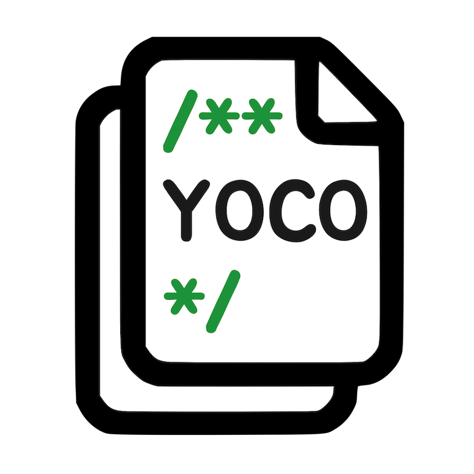
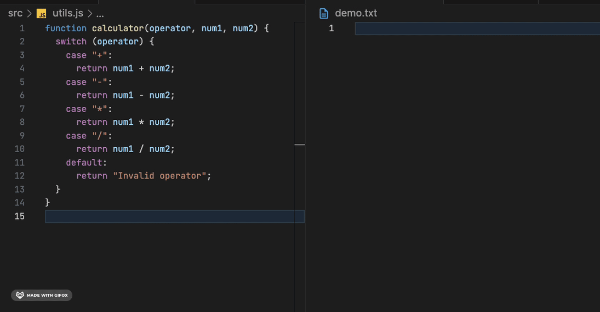

# YOCO (You Only Copy Once)

<p align="center">
  
</p>

**YOCO** automatically adds the file name at the top of any copied code, so that the file name is displayed when pasted.

Useful when transferring code to GPT, embedding in blogs, or for documentation purposes!



## Features

- Automatically adds the file name at the top of any copied code, so that the file name is displayed when pasted.
- Option to include file path, or just the file name.
- Automatically detects the language of the file being copied and inserts the file path in an appropriate comment format.
  
- Optionally wrap codeblock with backticks(```) when `YOCO.useBacktick` is set true.
  

### Key Binding

- Use `cmd+shift+c` / `ctrl+shift+c` to copy code with the file path included.

- You can also customize the shortcut, by assigning your desired key combination to the command `YOCO.copyTextWithFilePath` in your shortcut settings.

### Configuration

This extension contributes the following settings:

- `YOCO.includeFilePath`: Set to `true` to include the file path in the copied text.
- `YOCO.useBacktick`: Set to `true` to wrap codeblock with backticks(```).

## FAQ

- **Q: How do I use YOCO?**
  - A: Simply use the designated key binding (`cmd+shift+c` / `ctrl+shift+c`) to copy the text along with the file path.

## Contribution

If you would like to contribute to the development of YOCO, please refer to our [Contributing Guide](CONTRIBUTING.md).

## Development

For details on setting up your development environment and the development process, please see our [Development Guide](DEVELOPMENT.md).

## License

This project is licensed under the MIT License - see the [LICENSE](LICENSE) file for details.

## Donate

If you find YOCO useful and would like to support its continued development, consider donating at [Buy Me A Coffee](https://buymeacoffee.com/yoco).

**Enjoy!**
